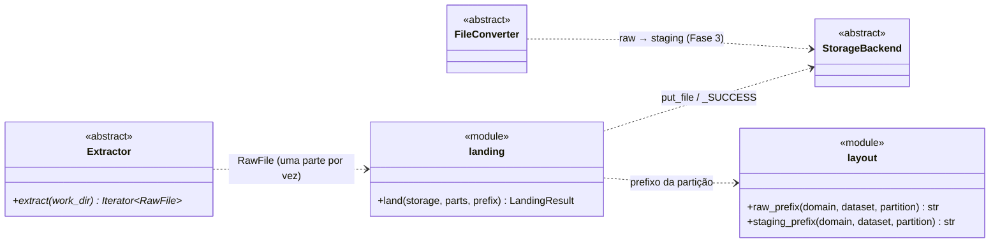
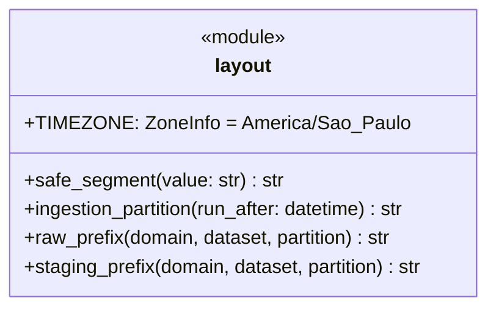
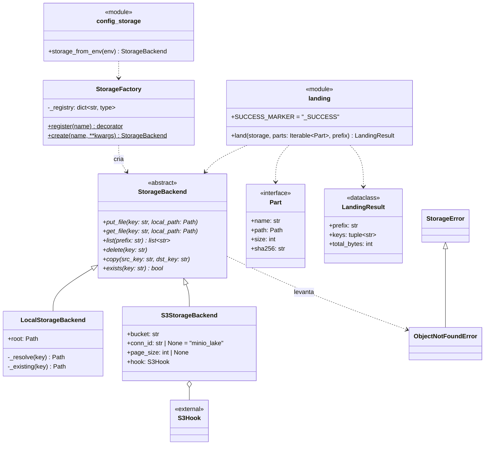
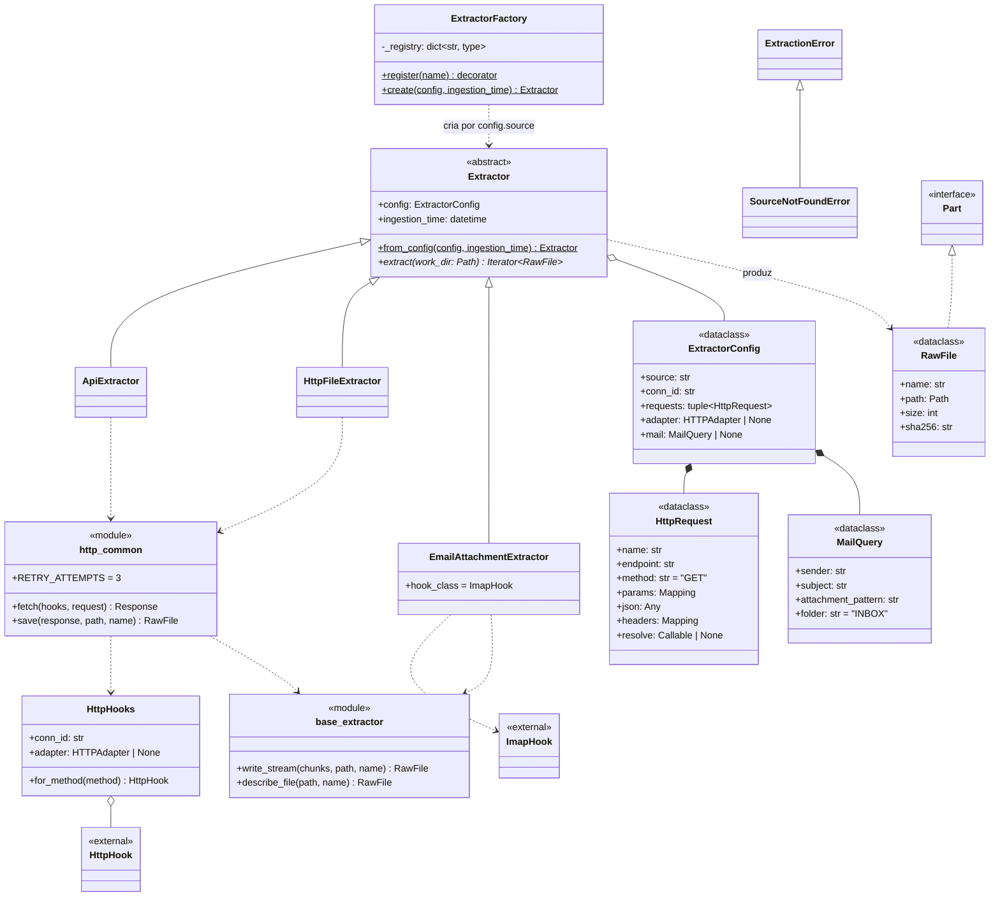
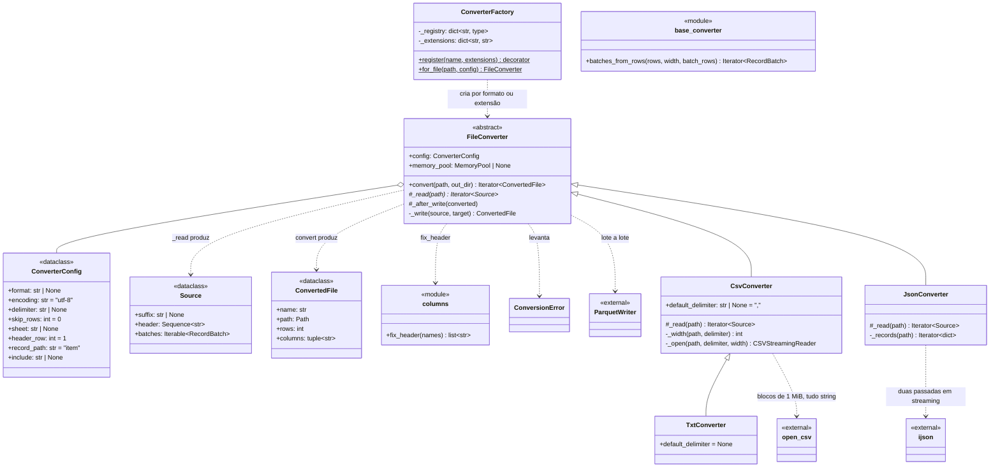

# Diagrama de classes da ingestão (`plugins/ingestion`)

Documentação técnica viva do pacote `plugins/ingestion`. Os diagramas estão em [Mermaid](https://mermaid.js.org/syntax/classDiagram.html) (`classDiagram`): o GitHub e o VS Code os renderizam direto, e o texto é editado como código, com diff no PR.

**Regra de manutenção:** toda mudança de classe, assinatura ou relação no pacote atualiza este arquivo no mesmo commit.

## Notação (UML)

| Elemento | Sintaxe Mermaid | Significado |
|---|---|---|
| `<<abstract>>` | `<<abstract>>` | Classe abstrata (ABC); métodos abstratos terminam em `*` |
| `<<interface>>` | `<<interface>>` | Protocolo estrutural (`typing.Protocol`) |
| `<<dataclass>>` | `<<dataclass>>` | `@dataclass(frozen=True)`, objeto de valor imutável |
| `<<module>>` | `<<module>>` | Funções de módulo, sem classe |
| `<<external>>` | `<<external>>` | Classe de biblioteca (providers do Airflow, pyarrow…) |
| Herança | `A <\|-- B` | B herda de A |
| Realização | `A <\|.. B` | B satisfaz a interface A |
| Composição | `A *-- B` | A contém B (B não existe sem A) |
| Agregação | `A o-- B` | A referencia B |
| Dependência | `A ..> B` | A usa B |
| Classe | `metodo()$` | Método de classe/estático |

## Visão geral: o fluxo

## `layout`: caminhos do lake

- **Partição:** `AAAA-MM-DD/HHMMSS` da ingestão, no horário de Brasília.
- **Prefixos:** `raw|staging/<domain>/<dataset>/<partição>/`.

## `storage`: object storage do lake

- **Registro:** `local` e `s3` se registram na `StorageFactory` com `@StorageFactory.register`.
- **Sem singleton:** cada `create` devolve uma instância nova.
- **`land`:** sobe uma parte por vez, apaga a cópia local e grava `_SUCCESS` com o manifesto por último.

## `extractors`: fonte → disco, no formato original

- **Estratégias registradas:** `api`, `http_file` e `email`.
- **`http_common`:**
  - retry com backoff só em 5xx e falha de rede;
  - 404 vira `SourceNotFoundError`, outro 4xx vira `ExtractionError`;
  - URL absoluta usa a sessão do hook.

## `converters`: raw → Parquet só texto (Fase 3, em construção)

- **Template Method:** `convert` é fixo. Cada formato implementa só `_read`, que devolve as tabelas do arquivo com o cabeçalho e as linhas em lotes de texto.
- **Fixo para todo formato:**
  - conserta o cabeçalho;
  - força `string` em todas as colunas;
  - escreve o Parquet lote a lote;
  - confere as linhas gravadas;
  - chama `_after_write`, gancho reservado para o drift (Fase 8).
- **Formatos registrados:**
  - `csv` (`.csv`, delimitador padrão `,`);
  - `txt` (`.txt`, `.tsv`): delimitador obrigatório, e o `.tsv` assume tabulação;
  - `json` (`.json`): registros em `record_path`, colunas = união das chaves, aninhado vira texto JSON.
- **Nome de saída:** o do arquivo da raw, com aba, tabela ou membro como sufixo (`relatorio__dotacao.parquet`).

## Próximas classes

Entram neste arquivo conforme forem implementadas:

| Fase | Classes |
|---|---|
| 3 | Conversores xlsx, mdb, parquet e zip; `convert_partition`, `publish_latest` |
| 4 | `LoadMode`, `LoadResult` |
| 5 | `DatasetSpec`, `pipeline.steps` |
| 7 | `Loader`, `PostgresCopyLoader` |
| 8 | Retrato e relatório de drift |
| 9 | `CatalogBackend`, `TableBackend`, `IcebergLoader` |
