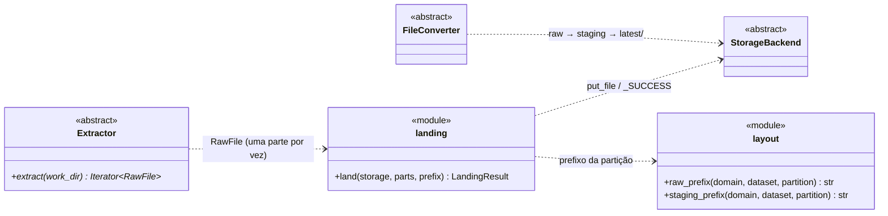
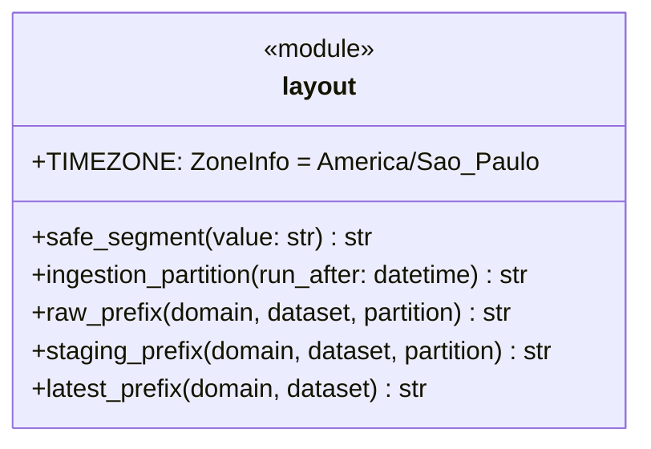
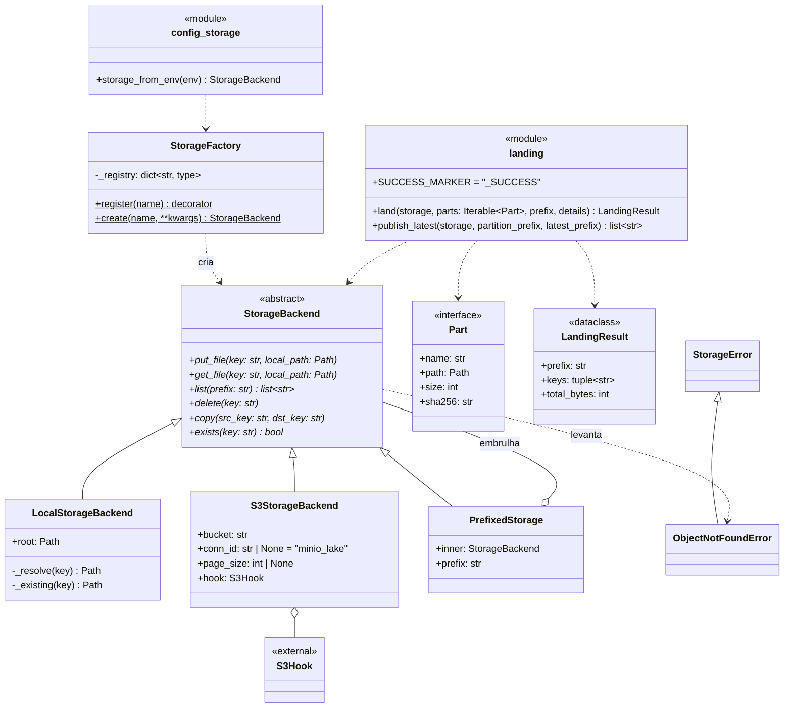
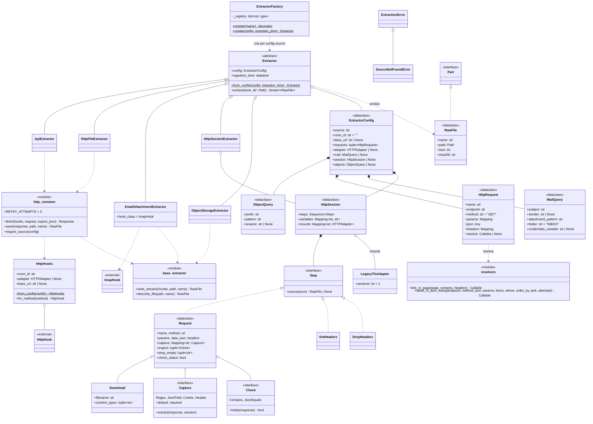
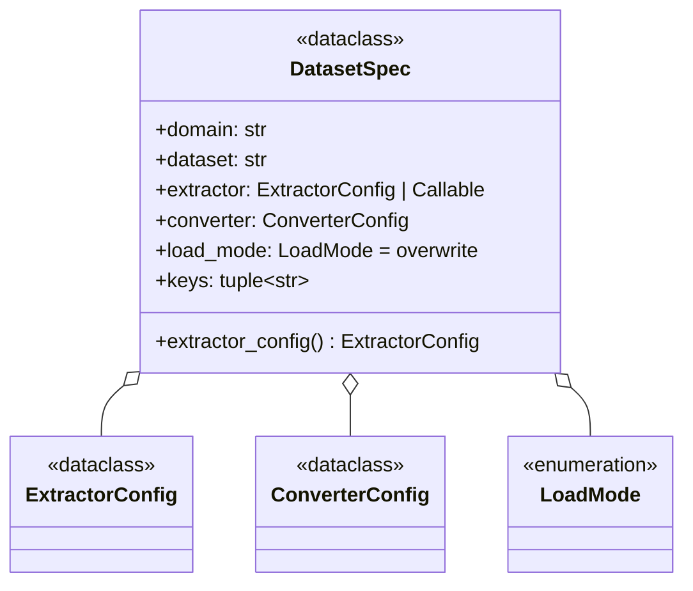
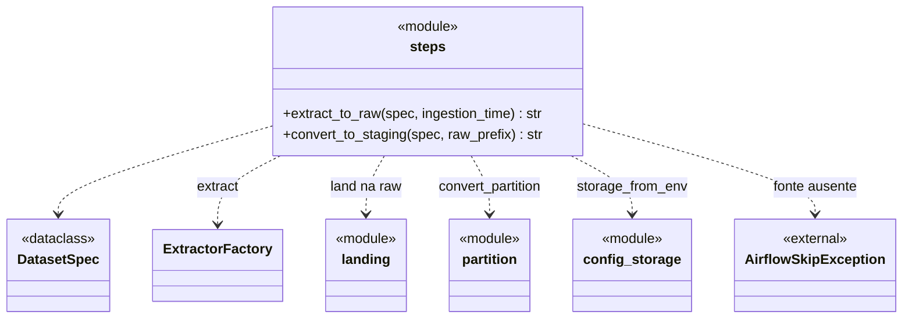
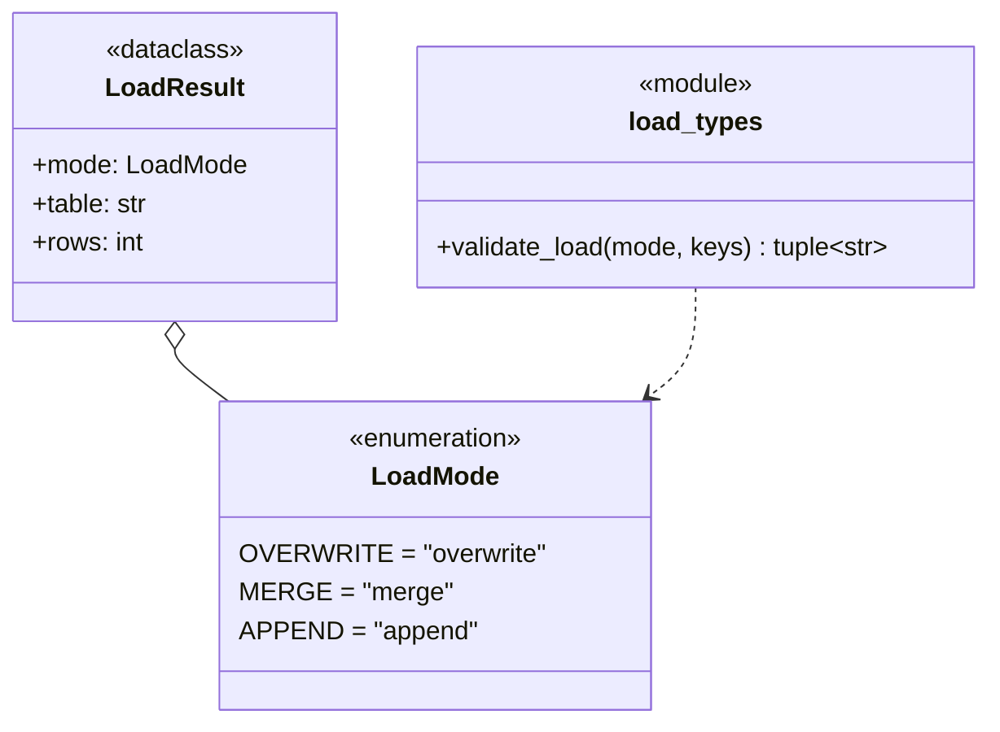

# Diagrama de classes da ingestão (`plugins/ingestion`)

Documentação técnica viva do pacote `plugins/ingestion`. Os diagramas estão em [Mermaid](https://mermaid.js.org/syntax/classDiagram.html) (`classDiagram`): o GitHub e o VS Code os renderizam direto, e o texto é editado como código, com diff no PR.

**Regra de manutenção:** toda mudança de classe, assinatura ou relação no pacote atualiza este arquivo no mesmo commit.

## Notação (UML)

| Elemento | Sintaxe Mermaid | Significado |
|---|---|---|
| `<<abstract>>` | `<<abstract>>` | Classe abstrata (ABC); métodos abstratos terminam em `*` |
| `<<interface>>` | `<<interface>>` | Protocolo estrutural (`typing.Protocol`) |
| `<<dataclass>>` | `<<dataclass>>` | `@dataclass(frozen=True)`, objeto de valor imutável |
| `<<enumeration>>` | `<<enumeration>>` | `Enum` (aqui, `StrEnum`) |
| `<<module>>` | `<<module>>` | Funções de módulo, sem classe |
| `<<external>>` | `<<external>>` | Classe de biblioteca (providers do Airflow, pyarrow…) |
| Herança | `A <\|-- B` | B herda de A |
| Realização | `A <\|.. B` | B satisfaz a interface A |
| Composição | `A *-- B` | A contém B (B não existe sem A) |
| Agregação | `A o-- B` | A referencia B |
| Dependência | `A ..> B` | A usa B |
| Classe | `metodo()$` | Método de classe/estático |

## Visão geral: o fluxo

## `layout`: caminhos do lake

- **Partição:** `AAAA-MM-DD/HHMMSS` da ingestão, no horário de Brasília.
- **Prefixos:** `raw|staging/<domain>/<dataset>/<partição>/`.

## `storage`: object storage do lake

- **Registro:** `local` e `s3` se registram na `StorageFactory` com `@StorageFactory.register`.
- **Sem singleton:** cada `create` devolve uma instância nova.
- **`PrefixedStorage`:**
  - embrulha um backend e enxerga só uma pasta dele;
  - `storage_from_env` o aplica quando há `INGESTION_STORAGE_PREFIX` (ex.: `tests/`, para rodar o pipeline real fora de `raw/` e `staging/`);
  - recusa `raw/` e `staging/` como prefixo.
- **`land`:** sobe uma parte por vez, apaga a cópia local e grava `_SUCCESS` com o manifesto por último. `details` acrescenta campos ao manifesto de cada parte.
- **`publish_latest`:**
  - espelha uma partição com `_SUCCESS` em `latest/<AAAA-MM-DD>/<HHMMSS>/`, que é o que o bronze lê (a partição no caminho dá o `dt_ingest`);
  - o `_SUCCESS` fica na raiz do `latest/`;
  - ordem: copia os novos, remove os que sobraram e copia o `_SUCCESS` por último.

## `extractors`: fonte → disco, no formato original

- **Estratégias registradas:** `api`, `http_file`, `email`, `http_session` e `object_storage`. Nenhuma tem nome de fonte: o que é de cada fonte é configuração na DAG.
- **`object_storage`:** copia para a raw os objetos que outro processo gravou no bucket (`ObjectQuery`: prefixo, padrão da chave, nome na raw). Lê o bucket sem o prefixo de teste (`storage_from_env(with_prefix=False)`): a fonte não muda com `INGESTION_STORAGE_PREFIX`.
- **Fonte pública × fonte com segredo:** fonte HTTP pública declara `base_url` na
  DAG, e o `HttpHooks` monta a Connection em memória; `conn_id` fica para fonte
  com credencial. Nada de Connection por fonte no `.env`.
- **`api` não guarda página de erro:** 2xx que declara HTML/XML (a página que o
  SGS do BACEN devolve com 200) entra no retry e, se persistir, falha. JSON
  servido como `text/plain` (Power BI público) passa.
- **`http_session`:** fluxo numa `requests.Session` própria (o HttpHook abre
  sessão nova a cada chamada), declarado como passos na DAG, como um navegador:
  `Request` (com capturas e conferências), `Download`, `SetHeaders` e
  `DropHeaders`. Capturas `Regex`, `JsonField`, `Cookie` e `Header`, com
  `default` ou `required=False` (mantém o valor anterior); valores e Variables
  entram por `{nome}`. Ex.: o login OutSystems e a navegação ASP.NET do ICST.
- **`resolvers`:** o `resolve` de uma `HttpRequest` para link que muda a cada
  edição: `link_in_page` (primeiro `<a href>` com o padrão) e
  `latest_in_json_listing` (item mais recente numa listagem JSON, com filtro,
  ordenação e tentativas; ex.: o catálogo de RI da MZ, para a MRV).
- **`email` com credencial em Variable:** com `credentials_variable`, a Connection do IMAP (e o remetente) é montada em runtime a partir da Variable JSON (`imap_server`, `email`, `password`, `sender_email`), sem Connection cadastrada.
- **`http_common`:**
  - retry com backoff só em 5xx e falha de rede;
  - 404 vira `SourceNotFoundError`, outro 4xx vira `ExtractionError`;
  - URL absoluta usa a sessão do hook.

## `converters`: raw → Parquet só texto

```mermaid
classDiagram
    class FileConverter {
        <<abstract>>
        +config: ConverterConfig
        +memory_pool: MemoryPool | None
        +convert(path, out_dir) Iterator~ConvertedFile~
        #_read(path) Iterator~Source~*
        #_after_write(converted)
        -_write(source, target) ConvertedFile
    }
    class ConverterFactory {
        -_registry: dict~str, type~
        -_extensions: dict~str, str~
        +register(name, extensions)$ decorator
        +for_file(path, config)$ FileConverter
    }
    class ConverterConfig {
        <<dataclass>>
        +format: str | None
        +encoding: str = "utf-8"
        +delimiter: str | None
        +skip_rows: int = 0
        +sheet: str | None
        +header_row: int = 1
        +record_path: str = "item"
        +key_column: str | None
        +include: str | None
    }
    class Source {
        <<dataclass>>
        +suffix: str | None
        +header: Sequence~str~
        +batches: Iterable~RecordBatch~
        +schema: Schema | None
    }
    class ConvertedFile {
        <<dataclass>>
        +name: str
        +path: Path
        +rows: int
        +columns: tuple~str~
    }
    class base_converter {
        <<module>>
        +batches_from_rows(rows, width, batch_rows) Iterator~RecordBatch~
    }
    class columns {
        <<module>>
        +fix_header(names) list~str~
    }
    class ConversionError
    class partition {
        <<module>>
        +convert_partition(storage, raw_prefix, staging_prefix, latest_prefix, config, work_dir) ConversionResult
    }
    class StagedFile {
        <<dataclass>>
        +name: str
        +path: Path
        +size: int
        +sha256: str
        +source: str
        +rows: int
        +columns: tuple~str~
    }
    class ConversionResult {
        <<dataclass>>
        +staging_prefix: str
        +latest_prefix: str
        +keys: tuple~str~
    }
    class Part {
        <<interface>>
    }
    class landing {
        <<module>>
    }
    class ParquetWriter {
        <<external>>
    }
    class CsvConverter {
        +default_delimiter: str | None = ","
        #_read(path) Iterator~Source~
        -_width(path, delimiter) int
        -_open(path, delimiter, width) CSVStreamingReader
    }
    class TxtConverter {
        +default_delimiter = None
    }
    class open_csv {
        <<external>>
    }
    class JsonConverter {
        #_read(path) Iterator~Source~
        -_records(path) Iterator~dict~
    }
    class ijson {
        <<external>>
    }
    class XlsxConverter {
        #_read(path) Iterator~Source~
        -_sheet_names(path, available) list~str~
        -_width(sheet) int
        -_rows(sheet, width, skip_header) Iterator~list~
    }
    class openpyxl {
        <<external>>
    }
    class MdbConverter {
        #_read(path) Iterator~Source~
        -_tables(path) list~str~
        -_table(path, table) Source
        -_batches(path, table, process, width) Iterator~RecordBatch~
    }
    class mdbtools {
        <<external>>
        mdb-tables
        mdb-export
    }
    class ParquetConverter {
        #_read(path) Iterator~Source~
    }
    class ZipConverter {
        #_read(path) Iterator~Source~
        -_members(archive) Iterator~ZipInfo~
    }
    class PowerBiDsrConverter {
        #_read(path) Iterator~Source~
    }

    FileConverter <|-- CsvConverter
    CsvConverter <|-- TxtConverter
    CsvConverter ..> open_csv : blocos de 1 MiB, tudo string
    FileConverter <|-- JsonConverter
    JsonConverter ..> ijson : duas passadas em streaming
    FileConverter <|-- XlsxConverter
    XlsxConverter ..> openpyxl : read_only, data_only
    FileConverter <|-- MdbConverter
    MdbConverter ..> mdbtools : pipe, sem arquivo intermediário
    MdbConverter ..> open_csv
    FileConverter <|-- ParquetConverter
    FileConverter <|-- ZipConverter
    ZipConverter ..> ConverterFactory : delega cada membro
    FileConverter <|-- PowerBiDsrConverter
    PowerBiDsrConverter ..> ijson : um resultado por vez
    partition ..> ConverterFactory : um arquivo da raw por vez
    partition ..> StagedFile : produz
    partition ..> ConversionResult
    Part <|.. StagedFile
    partition ..> landing : land + publish_latest

    FileConverter o-- ConverterConfig
    ConverterFactory ..> FileConverter : cria por formato ou extensão
    FileConverter ..> Source : _read produz
    FileConverter ..> ConvertedFile : convert produz
    FileConverter ..> columns : fix_header
    FileConverter ..> ParquetWriter : lote a lote
    FileConverter ..> ConversionError : levanta
```

- **Template Method:** `convert` é fixo. Cada formato implementa só `_read`, que devolve as tabelas do arquivo com o cabeçalho e as linhas em lotes de texto.
- **Fixo para todo formato:**
  - conserta o cabeçalho;
  - força `string` em todas as colunas;
  - escreve o Parquet lote a lote;
  - confere as linhas gravadas;
  - chama `_after_write`, gancho reservado para o drift (Fase 8).
- **Formatos registrados:**
  - `csv` (`.csv`, delimitador padrão `,`);
  - `txt` (`.txt`, `.tsv`): delimitador obrigatório, e o `.tsv` assume tabulação;
  - `json` (`.json`): registros em `record_path`, colunas = união das chaves, aninhado vira texto JSON; com `key_column`, as chaves de um objeto viram linhas (a data do pregão do Alpha Vantage); com `nested`, `explode_keys` e `columns` (`Field`, caminho com `[*]`, `{keys}`, `{values}` e `join`), JSON aninhado no estilo do `pandas.json_normalize` (ex.: o formato da API de agregados do IBGE, declarado na DAG);
  - `xlsx` (`.xlsx`, `.xlsm`): uma saída por aba, `header_row`, valor calculado da fórmula, célula vira texto por regra fixa;
  - `mdb` (`.mdb`, `.accdb`): uma saída por tabela (`<arquivo>__<tabela>`), `mdb-export` lido por pipe;
  - `parquet` (`.parquet`): mantém o schema original (`Source.schema`), a exceção ao "tudo string";
  - `zip` (`.zip`): um membro por vez, delegado ao conversor da extensão (`<zip>__<membro>`);
  - `powerbi_dsr` (só por `format`): o DSR do `querydata` do Power BI público, com as máscaras `Ø` (nulo) e `R` (repete a linha anterior) e os nomes do `descriptor`.
- **Nome repetido:** dois Parquet com o mesmo nome vindos de um mesmo arquivo são `ConversionError`.
- **`convert_partition`:**
  - exige o `_SUCCESS` da raw;
  - converte um arquivo da raw por vez e sobe os Parquet pelo `land`, que recusa nome repetido entre arquivos (`a.csv` e `a.json`);
  - grava o `_SUCCESS` da staging com origem, linhas e colunas de cada Parquet;
  - só então publica o `latest/`. Uma falha apaga o que já tinha subido para a partição (o glob do merge/append não lê Parquet órfão) e deixa o `latest/` como estava.
- **Nome de saída:** o do arquivo da raw, com aba, tabela ou membro como sufixo (`relatorio__dotacao.parquet`).

## `dataset`: o que a DAG declara

- **`DatasetSpec`:** fica no topo de cada DAG, só com literais.
- **Extrator preguiçoso:** `extractor` pode ser uma função que monta a configuração dentro da task (lendo uma Variable, como a lista de séries do BACEN). Nada é consultado no parse.
- **Validação:** `domain` e `dataset` viram pastas e precisam ser segmentos seguros; `load_mode` e `keys` passam por `validate_load`.

## `pipeline`: os passos das DAGs

- **Contrato entre tasks:** cada passo recebe e devolve só o prefixo de uma partição, um XCom pequeno.
  - `extract_to_raw` devolve `raw/<domain>/<dataset>/<AAAA-MM-DD>/<HHMMSS>/`;
  - `convert_to_staging` devolve `staging/<domain>/<dataset>/latest/`.
- **Resolução em runtime:** storage, Connection e Variable (o extrator preguiçoso do `DatasetSpec`) só são resolvidos dentro dos passos.
- **Skip:** fonte sem o dado vira `AirflowSkipException`, não falha.
- **Diretório de trabalho:** `LAKE_TMPDIR`.

## `loaders`: modos de carga

- **Modos:**
  - `overwrite`: a última ingestão substitui tudo, e deleções na fonte se propagam;
  - `merge`: por chave, vale a ingestão mais recente, e deleções não se propagam;
  - `append`: empilha todas as ingestões.
- **Regras** (iguais no `fonte_lake` do dbt): `merge` exige chaves, sem repetição; `overwrite` e `append` não aceitam chaves.
- **Onde o modo é aplicado:** no bronze, pelo macro `fonte_lake` (`dbt/mcid/macros/fonte_lake.sql`), a partir de `meta.load_mode` e `meta.keys` da fonte no `sources.yml`. Ele não é classe Python, então fica fora do diagrama.

## Próximas classes

Entram neste arquivo conforme forem implementadas:

| Fase | Classes |
|---|---|
| 7 | `Loader`, `PostgresCopyLoader` |
| 8 | Retrato e relatório de drift |
| 9 | `CatalogBackend`, `TableBackend`, `IcebergLoader` |
